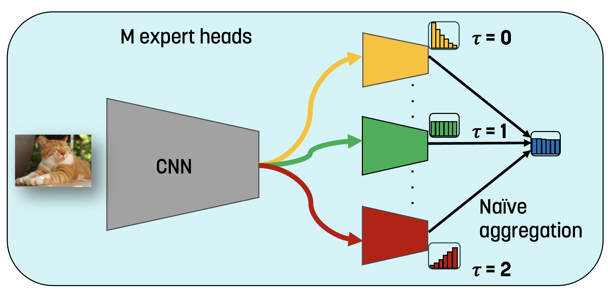

# 🌎 [CVPR 2023] BalPoE-CalibratedLT
by **Emanuel Sanchez Aimar, Arvi Jonnarth, Michael Felsberg, Marco Kuhlmann**

This repository contains the official Pytorch implementation of [Balanced Product of Calibrated Experts for Long-Tailed Recognition](https://openaccess.thecvf.com/content/CVPR2023/papers/Aimar_Balanced_Product_of_Calibrated_Experts_for_Long-Tailed_Recognition_CVPR_2023_paper.pdf) at CVPR 2023.

🎬[Video](https://www.youtube.com/watch?v=H664_EQq2cs) | 💻[Slides](assets/CVPR2023-short-presentation.pdf) | 🔥[Poster](assets/BalPoE-CalibratedLT-poster.pdf) | [ArXiv preprint](https://arxiv.org/abs/2206.05260) 

## Notes

- **[2025/03/12]** 🔥 Check out **ADELLO-LTSSL**, a flexible logit-adjustment framework for semi-supervised long-tailed recognition delivering robust calibration and SOTA performance—see our [ECCV 2024 paper](https://arxiv.org/abs/2306.04621) and [Github repo](https://github.com/emasa/ADELLO-LTSSL). 
 
## Method

<p align="center">  </p>

## Abstract
Many real-world recognition problems are characterized by long-tailed label distributions. These distributions make representation learning highly challenging due to limited generalization over the tail classes. If the test distribution differs from the training distribution, e.g. uniform versus long-tailed, the problem of the distribution shift needs to be addressed. A recent line of work proposes learning multiple diverse experts to tackle this issue. Ensemble diversity is encouraged by various techniques, e.g. by specializing different experts in the head and the tail classes. In this work, we take an analytical approach and extend the notion of logit adjustment to ensembles to form a Balanced Product of Experts (BalPoE). BalPoE combines a family of experts with different test-time target distributions, generalizing several previous approaches. We show how to properly define these distributions and combine the experts in order to achieve unbiased predictions, by proving that the ensemble is Fisher-consistent for minimizing the balanced error. Our theoretical analysis shows that our balanced ensemble requires calibrated experts, which we achieve in practice using mixup. We conduct extensive experiments and our method obtains new state-of-the-art results on three long-tailed datasets: CIFAR-100-LT, ImageNet-LT, and iNaturalist-2018.

## Getting Started

### Prerequisites

BalPoE-CalibratedLT is built on pytorch and a handful of other open-source libraries.

To install the required packages, you can create a conda environment:

```sh
conda create --name balpoe python=3.8
```

then use pip to install required packages:

```sh
pip install -r requirements.txt
```

### Hardware requirements
4 GPUs with >= 24G GPU RAM are recommended (for large datasets). Otherwise, the model with more experts may not fit in, especially on datasets with more classes (the FC layers will be large). We do not support CPU training at the moment.

## Datasets
### Four benchmark datasets
* Please download these datasets and put them to the /data file.
* CIFAR-100 / CIFAR-10 will be downloaded automatically with the dataloader.
* iNaturalist data should be the 2018 version from [here](https://github.com/visipedia/inat_comp).
* ImageNet-LT can be found at [here](https://drive.google.com/drive/u/1/folders/1j7Nkfe6ZhzKFXePHdsseeeGI877Xu1yf).

### Txt files
* We provide txt files for long-tailed recognition under multiple test distributions for ImageNet-LT and iNaturalist 2018. CIFAR-100 will be generated automatically with the code.
* For iNaturalist 2018, please unzip the iNaturalist_train.zip.
```
data_txt
├── ImageNet_LT
│   ├── ImageNet_LT_backward2.txt
│   ├── ImageNet_LT_backward5.txt
│   ├── ImageNet_LT_backward10.txt
│   ├── ImageNet_LT_backward25.txt
│   ├── ImageNet_LT_backward50.txt
│   ├── ImageNet_LT_forward2.txt
│   ├── ImageNet_LT_forward5.txt
│   ├── ImageNet_LT_forward10.txt
│   ├── ImageNet_LT_forward25.txt
│   ├── ImageNet_LT_forward50.txt
│   ├── ImageNet_LT_test.txt
│   ├── ImageNet_LT_train.txt
│   ├── ImageNet_LT_uniform.txt
│   └── ImageNet_LT_val.txt
└── iNaturalist18
    ├── iNaturalist18_backward2.txt
    ├── iNaturalist18_backward3.txt
    ├── iNaturalist18_forward2.txt
    ├── iNaturalist18_forward3.txt
    ├── iNaturalist18_train.txt
    ├── iNaturalist18_uniform.txt
    └── iNaturalist18_val.txt 
```

## Usage

### CIFAR100-LT 
#### Training

* Important: to reproduce our main results, train five runs with SEED = {1,2,3,4,5} and compute mean and standard deviation over reported results.

* To train BalPoE with three experts on the standard-training regime, run this command:
```
python train.py -c configs/mixup/standard_training/config_cifar100_ir100_bs-experts.json --seed 1
```

* To train BalPoE with three experts on the long-training regime using AutoAugment, run:
```
python train.py -c configs/mixup/long_training/config_cifar100_ir100_bs-experts.json --seed 1
```

* One can change the imbalance ratio from 100 to 10/50 by changing the config file. Similar instructions for CIFAR10-LT.
* Optionally, to train our framework with more experts, e.g. 7 experts, run:
```
python train.py -c configs/mixup/long_training/config_cifar100_ir100_bs-experts.json --tau_list limits --num_experts 7 --seed 1
```


#### Evaluate
* To evaluate BalPoE on the uniform distribution, run:
``` 
python test.py -r checkpoint_path
```

where checkpoint_path should be of the form CHECKPOINT_DIR/checkpoint-epoch[LAST_EPOCH].pth, 
where LAST_EPOCH is 200 and 400 for standard and long training, respectively.

* To evaluate on diverse test class distributions, run:
``` 
python test_all_cifar.py -r checkpoint_path [--posthoc_bias_correction]
```

Optional: use --posthoc_bias_correction to adjust logits with known test prior.

### iNaturalist 2018
#### Training
* To train BalPoE with three experts on the standard-training regime, run this command:
```
python train.py -c configs/mixup/standard_training/config_iNaturalist_resnet50_bs-experts.json
``` 

* To train BalPoE with three experts on the long-training regime using RandAugment, run this command:
```
python train.py -c configs/mixup/long_training/config_iNaturalist_resnet50_bs-experts.json
```

#### Evaluate
* To evaluate BalPoE on the uniform distribution, run:
``` 
python test.py -r checkpoint_path
```

where checkpoint_path should be of the form CHECKPOINT_DIR/checkpoint-epoch[LAST_EPOCH].pth, 
where LAST_EPOCH is 100 and 400 for standard and long training, respectively.

* To evaluate on diverse test class distributions, run:
``` 
python test_all_inat.py -r checkpoint_path [--posthoc_bias_correction]
``` 

Optional: use --posthoc_bias_correction to adjust logits with known test prior.

### ImageNet-LT
#### Training
* To train BalPoE with three experts on the standard-training regime, run this command:
```
python train.py -c configs/mixup/standard_training/config_imagenet_lt_resnext50_bs-experts.json
```

* To train BalPoE with three experts on the long-training regime using RandAugment, run this command:
```
python train.py -c configs/mixup/long_training/config_imagenet_lt_resnext50_bs-experts.json
```

* Alternatively, train with ResNet50 backbone by using the corresponding config file.

#### Evaluate
* To evaluate BalPoE on the uniform distribution, run:
``` 
python test.py -r checkpoint_path
```
where checkpoint_path should be of the form CHECKPOINT_DIR/checkpoint-epoch[LAST_EPOCH].pth, 
where LAST_EPOCH is 180 and 400 for standard and long training, respectively.

* To evaluate the model on different test distributions, run:
``` 
python test_all_imagenet.py -r checkpoint_path
```

Optional: use run the following command to accomodate for a known test prior.
``` 
python test_all_imagenet.py -r checkpoint_path --posthoc_bias_correction
```

## Citation
If you find our work inspiring or use our codebase in your research, please cite our work.
```
@InProceedings{SanchezAimar2023BalPoE_CalibratedLT,
    author    = {Sanchez Aimar, Emanuel and Jonnarth, Arvi and Felsberg, Michael and Kuhlmann, Marco},
    title     = {Balanced Product of Calibrated Experts for Long-Tailed Recognition},
    booktitle = {Proceedings of the IEEE/CVF Conference on Computer Vision and Pattern Recognition (CVPR)},
    month     = {June},
    year      = {2023},
    pages     = {19967-19977}
}

@InProceedings{SanchezAimar2024ADELLO_LTSSL,
    author="Sanchez Aimar, Emanuel
    and Helgesen, Nathaniel
    and Xu, Yonghao
    and Kuhlmann, Marco
    and Felsberg, Michael",
    title="Flexible Distribution Alignment: Towards Long-Tailed Semi-supervised Learning with Proper Calibration",
    booktitle="Computer Vision -- ECCV 2024",
    year="2025",
    editor="Leonardis, Ale{\v{s}}
    and Ricci, Elisa
    and Roth, Stefan
    and Russakovsky, Olga
    and Sattler, Torsten
    and Varol, G{\"u}l",
    publisher="Springer Nature Switzerland",
    address="Cham",
    pages="307--327",
    isbn="978-3-031-72949-2"
}
```

## Acknowledgements

Our codebase is based on several open-source projects, particularly: 
- [SADE](https://github.com/Vanint/SADE-AgnosticLT) 
- [RIDE](https://github.com/frank-xwang/RIDE-LongTailRecognition)
- [BagOfTricksLT](https://github.com/zhangyongshun/BagofTricks-LT)

This is a project based on this [pytorch template](https://github.com/victoresque/pytorch-template). 
